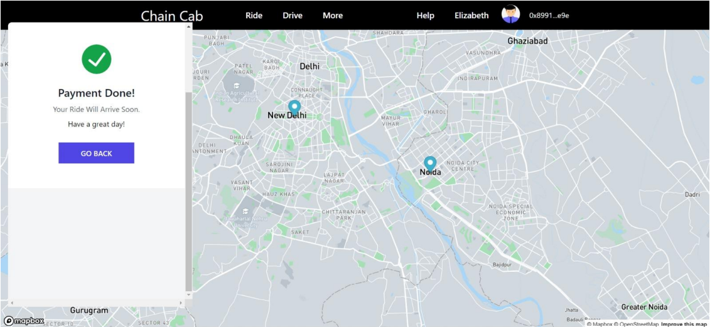
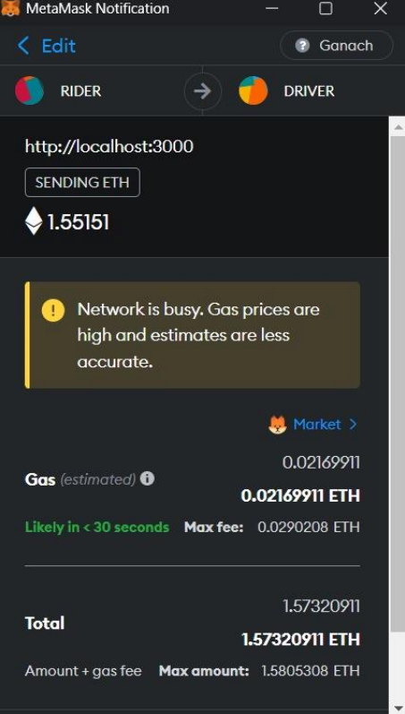
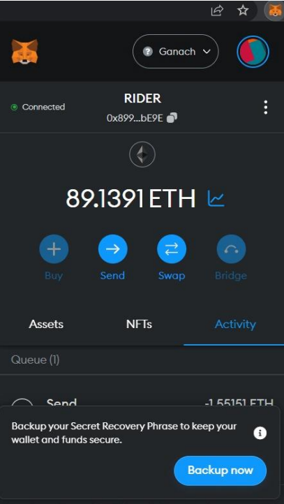
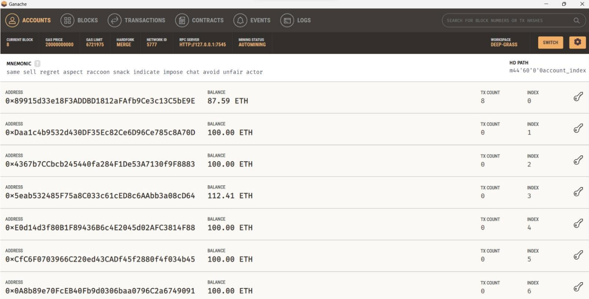

# Chain Cab Web 3.0 Project Readme

The Chain Cab Web 3.0 project is a decentralized ride-sharing application that leverages blockchain technology to enable peer-to-peer renting of cars based on predetermined requirements. Unlike existing ride-sharing applications that rely on centralized systems, Chain Cab's decentralized nature provides increased security, transparency, and autonomy for its users.

## Tech Stack

The Chain Cab Web 3.0 project is built using the following technologies:

### Frontend
- ReactJS: A popular JavaScript library for building user interfaces.
- JavaScript: The programming language used for client-side interactions.
- HTML: The standard markup language for creating web pages.
- Tailwind CSS: A utility-first CSS framework that enables rapid UI development.

### Database
- Sanity.io: A flexible and customizable headless content management system used to manage the application's data.

### Blockchain
- Solidity: A programming language used for developing smart contracts on the Ethereum blockchain.

### Fake Ethers
- Metamask: A browser extension that allows the usage of fake ethers for testing and development purposes on the Ethereum blockchain.

### Backend
- MongoDB: A NoSQL database used for storing application data.

### Deployment
- Vercel: A cloud platform that simplifies the deployment and hosting of web applications.

## Getting Started

To set up the Chain Cab Web 3.0 project on your local machine, follow these steps:

1. Clone the repository from GitHub:
   ```
   git clone https://github.com/Abhishekydv097/Chain_Cab.git
   ```

2. Navigate to the project directory:
   ```
   cd CHAINCAB
   ```

3. Install the frontend dependencies:
   ```
   npm install
   ```
   ```

5. Start the frontend development server:
   ```
   npm run dev
   ```


   ```

7. Access the application in your web browser:
   ```
   http://localhost:3000
   ```

## Usage

Chain Cab Web 3.0 provides a user-friendly interface for renting cars using the blockchain. Users can interact with the application using the frontend interface built with ReactJS, and the application will communicate with the backend server and the Ethereum blockchain (via Metamask) for handling smart contracts and transactions.

## Contributions

https://github.com/Abhishekydv097

## License

The Chain Cab Web 3.0 project is licensed under [MIT License](LICENSE). Feel free to use, modify, and distribute the code as per the terms of the license.

## Disclaimer

The fake ethers provided through Metamask are for testing and development purposes only. Please refrain from using real ethers or performing actual financial transactions with this application.

## Screenshots
Landing Page:


PaymentSuccess:




Metamask before payment ethers:
<p align="center">
  
</p>

Metamask after paying with ethers:


<p align="center">
  
</p>

Ganache for local ethers:





Happy ride-sharing with Chain Cab Web 3.0!